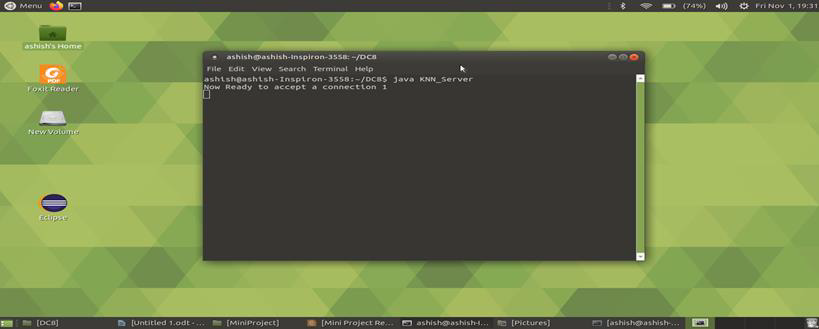

# Client Server Implementation of Distributed K-Nearest Neighbour Algorithm

This is a distributed implementation of K-nearest neighbour algorithm where any no of slave nodes or client nodes are connected to master node (here server). The server breaks the dataset into equal chunks and sends it to connected slave nodes for computation. After receiving the required information from the server, each slave node does the required computation and then sends the result back to the server. Server after collecting the results back from all the clients, perform merge
operation and then gives the final result.

- **TECHNOLOGY USED:** java Threads, java sockets.
- **DATASET USED:**    Iris dataset (retrieved from uci repository).
- **CLASSES USED:**
1. KNN_Server: - Server class at first accept connection from n client nodes (no of clients is hard coded) and then it accepts test case from user and gives back the result as to which class the test case belongs.
2. KNN_ClientHandler: - Thread class to manage, send and receive data from multiple clients.
3. Shared: - Acts as a global interface between server and client Handler
4. KNN_client: - Client class receives data from the server does the required computation and sends it back to the server

## HOW TO RUN THE APPLICATION: USE THE FOLLOWING INSTRUCTION
- **To compile all the files:** > `javac *.java`
- **Running the server:** > `java KNN_Server` (This will start the server and waits for clients to connect.)
- **Running the client:** > `java KNN_client` (You have to run at least 1client to run this application). Here we are running two client nodes.

